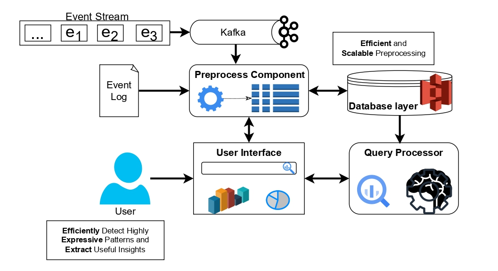

# SIESTA DEMO

## Overview
Analyzing sequential event data tremendously benefits organizations by enabling them to identify potential 
process optimizations and extract useful insights.  However, there is a lack of systems that can both 
efficiently query complex ad-hoc patterns and perform advanced sequential pattern mining-like tasks. 
To address this, we have proposed **SIESTA**, which stands for Scalable Infrastructure for sEquential paTtern Analysis, 
and is a scalable tool designed to support both pattern detection and pattern mining in large event log datasets that 
are continuously updated.
This repository demonstrates how the entire **SIESTA** infrastructure can be deployed using Docker
containers. 


## Architecture

SIESTA's infrastructure is composed of three primary components along with additional supporting tools:

- **Preprocess Component**: Handles incoming data and computes the appropriate indices. It can operate in two modes, 
that is events can arrive (i) in batches, e.g., every hour, and (ii) in real-time stream, 
where the data are read from a source, like Apache Kafka.
- **Database Layer**: After the indices are computed, they are stored in a database.
SIESTA is designed to be decoupled from the storage mechanism, enhancing its scalability and flexibility.
In the current implementation, we used an Object Storage System (OSS) with the S3 protocol via **MinIO** an open source
implementation of S3
- **Query Processor**: This component functions as a RESTful API designed to handle pattern queries. 
It leverages the stored indices to prune the search space and provide efficient responses.
- **User Interface**: A React-based web application that enables end users to fully access all functionalities in a user-friendly manner.
- **Message Broker**: Utilizes **Apache Kafka** for event streaming.
- **Supporting Services**:  **PostgreSQL** (for metadata storage), and **Zookeeper** (for Kafka coordination).

All containers communicate within an internal **Docker network**.

## Prerequisites
Ensure that you have the following installed on your system:

- [Docker](https://www.docker.com/)
- [Docker Compose](https://docs.docker.com/compose/)

## Installation & Deployment
To deploy the entire SIESTA infrastructure, run the following command from the root directory:

```bash
docker-compose up -d
```

## Configuration
All images for the **SIESTA** infrastructure are available in [DockerHub](https://hub.docker.com/u/mavroudo), 
with descriptions of the required environmental variables. Each repository also contains instructions for building the 
images from scratch.

### Environment Variables
Below are the essential environment variables used in the **docker-compose.yml** file, categorized by service:

#### **Preprocess Component**
- `s3accessKeyAws`: MinIO access key (default: `minioadmin`)
- `s3secretKeyAws`: MinIO secret key (default: `minioadmin`)
- `s3ConnectionTimeout`: Connection timeout for S3 (default: `600000`)
- `s3endPointLoc`: Endpoint location of MinIO (default: `http://minio:9000`)
- `kafkaBroker`: Kafka broker URL (default: `http://kafka:9092`)
- `kafkaTopic`: Kafka topic name (default: `test`)
- `POSTGRES_ENDPOINT`: PostgreSQL connection endpoint (default: `postgres:5432/metrics`)
- `POSTGRES_USERNAME`: PostgreSQL username (default: `admin`)
- `POSTGRES_PASSWORD`: PostgreSQL password (default: `admin`)

#### **Query Processor**
- `master.uri`: Spark master URI (default: `local[4]` or `local[*]`)
- `database`: Database type used (`s3` for object storage)
- `delta`: Boolean flag for batch (`false`) or streaming (`true`) processing
- `s3.endpoint`: MinIO endpoint (default: `http://minio:9000`)
- `s3.user`: MinIO access key (default: `minioadmin`)
- `s3.key`: MinIO secret key (default: `minioadmin`)
- `s3.timetout`: S3 connection timeout (default: `600000`)
- `server.port`: Port for the query processor application (default: `8090`)

#### **MinIO (Object Storage)**
- `MINIO_ROOT_USER`: MinIO root username (default: `minioadmin`)
- `MINIO_ROOT_PASSWORD`: MinIO root password (default: `minioadmin`)

#### **PostgreSQL Database**
- `POSTGRES_DB`: Name of the PostgreSQL database (default: `metrics`)
- `POSTGRES_USER`: PostgreSQL username (default: `admin`)
- `POSTGRES_PASSWORD`: PostgreSQL password (default: `admin`)

#### **Kafka & Zookeeper**
- `ZOOKEEPER_CLIENT_PORT`: Port for Zookeeper client connections (default: `2181`)
- `KAFKA_BROKER_ID`: Unique identifier for Kafka broker (default: `1`)
- `KAFKA_ZOOKEEPER_CONNECT`: Zookeeper connection string (default: `zookeeper:2181`)
- `KAFKA_LISTENER_SECURITY_PROTOCOL_MAP`: Security protocol mapping (default: `INSIDE:PLAINTEXT,OUTSIDE:PLAINTEXT`)
- `KAFKA_ADVERTISED_LISTENERS`: Advertised listeners for Kafka broker (default: `INSIDE://:9093,OUTSIDE://siesta-kafka:9092`)
- `KAFKA_LISTENERS`: Kafka listeners configuration (default: `INSIDE://:9093,OUTSIDE://:9092`)
- `KAFKA_INTER_BROKER_LISTENER_NAME`: Inter-broker listener name (default: `INSIDE`)
- `KAFKA_OFFSETS_TOPIC_REPLICATION_FACTOR`: Replication factor for Kafka topics (default: `1`)

## Usage Examples
Here are a few example executions to help you get started:

### Example 1: Submitting a logfile for preprocessing
The first thing that we have to do is preprocess a logfile. In `/datasets` we provide two small datasets for testing.
You can submit preprocess a logfile, either by utilizing the [UI](http://localhost:80/preprocessing) which will allow
us to upload a logfile or by sending a CURL
request to the preprocessing component. More information about the functionalities of the preprocess component can be 
found in its [repo](https://github.com/siesta-tool/SequenceDetectionPreprocess). Lets test the second way. Assuming that 
we want to preprocess the `test.withTimestamp` logfile that is inside the `/datasets` folder, we have to execute the following:
```bash
curl -X 'POST' 'http://localhost:8000/preprocess' \
  -H 'Content-Type: application/json' \
  -d '{
    "spark_master": "local[*]",
    "file": "test.withTimestamp",
    "logname": "test"
  }'
```
Notes:
1. The logfile is visible to the preprocess as we have included a docker volume between the datasets and the place where
it stores the uploaded files.
2. This will start a preprocess task and return a unique id that we can use to monitor the tasks process.
3. Once the task is completed, we have to refresh the indices in the UI, and then we will be able to see the new index
   (called "test").

### Example 2: Submitting a detection query for the processed log
Now that the testing logfile has been indexed we can submit queries to the query processor. Again this can be done
by either the [UI](http://localhost:80/indexes/test) or by sending request directly to the query processor. Lets try
to find all traces in the test logfile that contains the pattern <A_,B_> (i.e., an instance of the event A followed by 
an instance of the event B). The `_` dictates that we just want a single instance of this event. SIESTA also supports
other symbols like: 
- `+`: one or more occurrence
- `*`: zero or more occurrences
- `!`: negation
- `||`: disjunction between two events (e.g,A or B)

The curl request will be:
```bash
curl -X 'POST' 'http://localhost:8090/detection' \
  -H 'Content-Type: application/json' \
  -d '{"log_name":"test","pattern":{"eventsWithSymbols":[{"name":"A","position":0,"symbol":"_"},{"name":"B","position":1,"symbol":"_"}]},"returnAll":null,"hasGroups":false,"groups-config":null,"whyNotMatchFlag":false,"wnm-config":null}'
```
And the response will be something like this:
```json
{"occurrences":[
  {"traceID":"2","occurrences":[{"occurrence":[{"name":"A","position":0},{"name":"B","position":1}]}]},
  {"traceID":"1","occurrences":[{"occurrence":[{"name":"A","position":0},{"name":"B","position":2}]}]},
  {"traceID":"3","occurrences":[{"occurrence":[{"name":"A","position":0},{"name":"B","position":3}]}]}],
  "performance statistics":{"time for pruning in ms":1114,"time for validation in ms":1,"response time in ms":1115}}
```
which says that the pattern <A,B> exists in the traces with ids 1, 2 and 3 and also contains some information about
the performance of the query.
Note that in the curl request there are a number of different fields that were not set, these correspond to the different
filters that are allowed by the detection query. This includes the minimum (or maximum) timespan between two events,
the time window of interest. We can also group different traces together (in query time) and even provide explanations 
about unexpected outputs. All these are hard to configure through command-line and that is why we advise any new user to utilize
the UI.

### Example 3: Submitting a mining query for the processed log
SIESTA efficiently mines declarative constraints based on 21 different templates from the DECLARE language. 
These templates act as constraint blueprints, and can be utilized in applications such as outlier detection, 
conformance checking, and event prediction. To extract all the constraints the example log we can simply go to the
**Mining Constraint** tab in the [UI](http://localhost:80/indexes/test), check all boxes, set the minimum support
that a constraint should have in order to appear in the final set and the click submit (or
again submit a curl request).
```bash
curl -X 'GET' 'http://localhost:8090/declare/?log_database=test&support=0.9'
```
And the response will be a long list with constraints
```json lines
{"existence patterns":{"absence":[{"n":3,"ev":"D","support":"1.000"},
  {"n":2,"ev":"D","support":"1.000"},{"n":3,"ev":"C","support":"1.000"}],
  "exactly":[],
  "existence":[{"n":2,"ev":"A","support":"1.000"},{"n":1,"ev":"A","support":"1.000"},
    {"n":1,"ev":"C","support":"1.000"}],
  "co-existence":[{"evA":"A","evB":"C","support":"1.000"}],
  "not co-existence":null,
  "choice":[{"evA":"B","evB":"C","support":"1.000"},
    {"evA":"B","evB":"D","support":"1.000"},{"evA":"A","evB":"B","support":"1.000"},
    {"evA":"A","evB":"C","support":"1.000"},{"evA":"A","evB":"D","support":"1.000"},
    {"evA":"C","evB":"D","support":"1.000"}],
  "exclusive choice":[{"evA":"D","evB":"B","support":"1.000"}],
  "responded existence":[{"evA":"B","evB":"C","support":"1.000"},
    {"evA":"B","evB":"A","support":"1.000"},{"evA":"A","evB":"C","support":"1.000"},
    {"evA":"C","evB":"A","support":"1.000"},{"evA":"D","evB":"A","support":"1.000"},
    {"evA":"D","evB":"C","support":"1.000"}]},
  "position patterns":{"first":[{"ev":"A","support":"1.000"}], "last":[]},
  "ordered relations":{"mode":"simple", 
    "response":[{"evA":"D","evB":"A","support":"1.000"},
      {"evA":"B","evB":"C","support":"1.000"},
      {"evA":"A","evB":"C","support":"0.900"}],
  "precedence":[{"evA":"A","evB":"C","support":"1.000"},
    {"evA":"A","evB":"B","support":"1.000"},{"evA":"C","evB":"D","support":"1.000"},
    {"evA":"A","evB":"D","support":"1.000"}],
  "succession":[{"evA":"A","evB":"C","support":"0.900"}],
  "not-succession":[{"evA":"D","evB":"C","support":"1.000"},
    {"evA":"B","evB":"D","support":"1.000"}, {"evA":"D","evB":"B","support":"1.000"}]},
  "ordered relations alternate":{"mode":"alternate","response":[{"evA":"D","evB":"A","support":"1.000"}],
    "precedence":[{"evA":"C","evB":"D","support":"1.000"},{"evA":"A","evB":"D","support":"1.000"}],
    "succession":[],"not-succession":[]},
  "ordered relations chain":{"mode":"chain","response":[{"evA":"D","evB":"A","support":"1.000"}],
    "precedence":[{"evA":"C","evB":"D","support":"1.000"}],"succession":[],
    "not-succession":[{"evA":"D","evB":"C","support":"1.000"},
      {"evA":"B","evB":"D","support":"1.000"},
      {"evA":"D","evB":"B","support":"1.000"},{"evA":"A","evB":"D","support":"1.000"}]}}
```
Obviously, this looks better in the UI.

### _Bonus example:_ Incremental Declare Mining
A recently added feature is **Incremental Declare Mining**. This allows users to perform a small post-processing step after index building to extract key statistics. These statistics enhance the query processor’s ability to efficiently extract Declare constraints.
Although this post-processing step is integrated into the preprocessing component, it can also be used independently. For example, a company might choose to index its log files every few hours but may only need to mine the most recent constraints once a week.
Additionally, the query processor will automatically utilize these statistics when available, requiring no extra configuration. This feature is particularly beneficial in **big data scenarios**, where event volume grows significantly.
To demonstrate this, we have included an extended example in the [`incremental_mining`](./incremental_mining) folder, showcasing how we artificially generate large log files and incrementally extract constraints.

## Datasets
Two sample event logs are available in the `/datasets` folder. The datasets are formatted in two ways:
- **Custom Format (`.withTimestamp`)**: Contains trace IDs, event types, and timestamps separated by `**/delab/**`.
- **XES Format (`.xes`)**: A standard format used in **Business Process Management**.


## Publications
SIESTA has been featured in various publications:

1. [**Sequence detection in event log files**](https://openproceedings.org/2021/conf/edbt/p68.pdf) - Conference EDBT 2021
2. [**SIESTA: A scalable infrastructure of sequential pattern analysis**](https://ieeexplore.ieee.org/abstract/document/9984935) - IEEE Transaction on Big Data 2022

3. [**A Comprehensive Scalable Framework for Cloud-Native Pattern Detection with Enhanced Expressiveness**](https://arxiv.org/pdf/2401.09960) - Arxiv 2024
4. [**Exploiting General Purpose Big-Data Frameworks in Process Mining: The Case of Declarative Process Discovery**](https://link.springer.com/chapter/10.1007/978-3-031-70396-6_11) - Conference BPM 2024


## License
This project is licensed under the **MIT License**. See the `LICENSE` file for details.

## Additional Resources
- [Demo Video](https://drive.google.com/file/d/1TzgwGuBD05qBT1cegLKHKJZmJt2DHQ3j/view?usp=sharing)
- [Preprocessing Component](https://github.com/siesta-tool/SequenceDetectionPreprocess) 
- [Query Processor](https://github.com/siesta-tool/SequenceDetectionQueryExecutor)
- [User Interface](https://github.com/siesta-tool/siesta-ui)