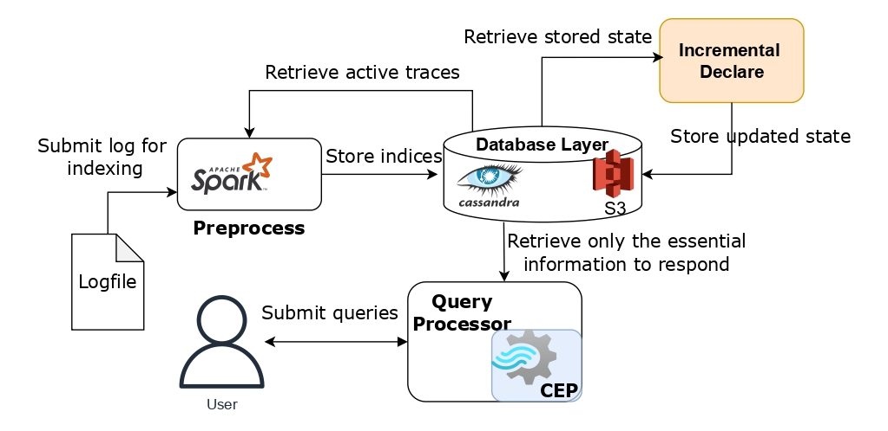

# Incremental Declare Mining

## Overview

This example demonstrates how SIESTA can incrementally extract Declare constraints from continuously arriving
logs. As shown in the figure, the Incremental Declare component is independent of the remaining process, meaning
that it can be executed in different time intervals than the preprocessing. However, in this example we will
execute them together.

In our recent work, we compared the efficiency of this system with other state-of-the-art systems that extract the same
constraints. The list of competitors contains:
1. MINERful
2. Declare Miner
3. Graph-based approach
4. SQL approach

We have included detailed instructions on how to execute all these methods in this [repository](https://github.com/siesta-tool/SIESTA-BPM-experiments)


## Creating multiple realistic datasets
In order to run the scripts that will create a python virtual environment and then install the requirements.
to do that, execute the following commands:

```bash
python3 -m venv venv
source venv/bin/activate
pip install -r requirements.txt
```
Or you can simply install it to your machine, without the use of a virtual environment.

The script `create_realistic_datasets.py` is designed to generate multiple datasets from a single
real-world dataset. Each dataset consists of event logs where some traces are carried over (about 10%) while 
others are assigned new trace IDs. The process is optimized using multi-threading.

### Parameters:
- **logfile (str)**: Path to the input dataset file (in XES format).
- **want_days (int)**: The number of days each log should expand.
- **num_logs (int)**: The number of logs to be generated.

### Example Usage:
```bash
python create_realistic_datasets.py ../datasets/test.xes 1 3
```
This will create 3 logs from `test.xes` (located in the datasets), each covering a span of 1 day.

## Running Incremental Mining on SIESTA

Assuming that SIESTA is up and running and after the datasets are generated and placed in the `/datasets` folder,
we can start the preprocessing task along with the incremental mining with the following curl request:
```bash
curl -X 'POST' 'http://localhost:8000/preprocess' \
  -H 'Content-Type: application/json' \
  -d '{
    "spark_master": "local[*]",
    "file": "test_0.withTimestamp",
    "logname": "test",
    "declare_incremental": "true"
  }'
```
Note that the request is the same as a preprocessing request, with the parameter declare_incremental set to true.
In the scenario where you want to execute the Incremental Declare without preprocessing new events (i.e., for already
indexed events) you just omit the file parameter. Make sure to always specify the correct logname.
```bash
curl -X 'POST' 'http://localhost:8000/preprocess' \
  -H 'Content-Type: application/json' \
  -d '{
    "spark_master": "local[*]",
    "logname": "test",
    "declare_incremental": "true"
  }'
```
When executing the Incremental Declare component, it automatically identifies and indexes all 
new events—i.e., events that have been recorded since its last execution- and incrementally extracts
the required statistics. The query processor then leverages these extracted statistics to efficiently respond to 
mining queries in constant time.
The query processor always prioritizes using precomputed statistics when available. However, in cases
where the statistics are outdated, it still utilizes the existing data but provides additional metrics 
indicating the percentage of events and traces that have been indexed. In such instances, it also prompts 
the user to rerun the Incremental Declare component to ensure up-to-date numbers.


## Running Mining for Competitors
Since the other systems that mine Declare constraints operate on a single event log, the multiple datasets needs to be 
merged into a single event log in XES format. The `combine_datasets.py` script is used for that reason.
The default values of the parameters correspond to the custom `.withTimestamp` extension.

### Parameters:
- `--delimiter` (str, default: `/delab/`): Specifies the delimiter used for separating event attributes.
- `--separator` (str, default: `,`): Defines the separator between events in a single trace.
- `input_files` (list of str): List of input dataset files.
- `output_file` (str): Path to the output XES file.

### Example Usage:
```bash
python combine_datasets.py test_0.withTimestamp test_1.withTimestamp test_2.withTimestamp output.xes
```
This command processes merges the output files from the previous script to create `output.xes` in XES 
format, which can then be used as input to the other systems.

